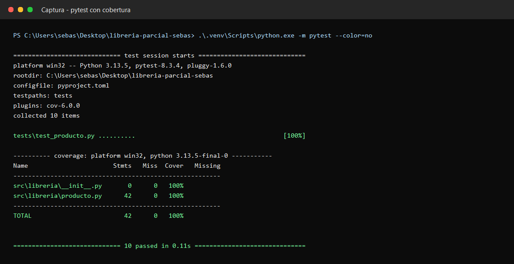
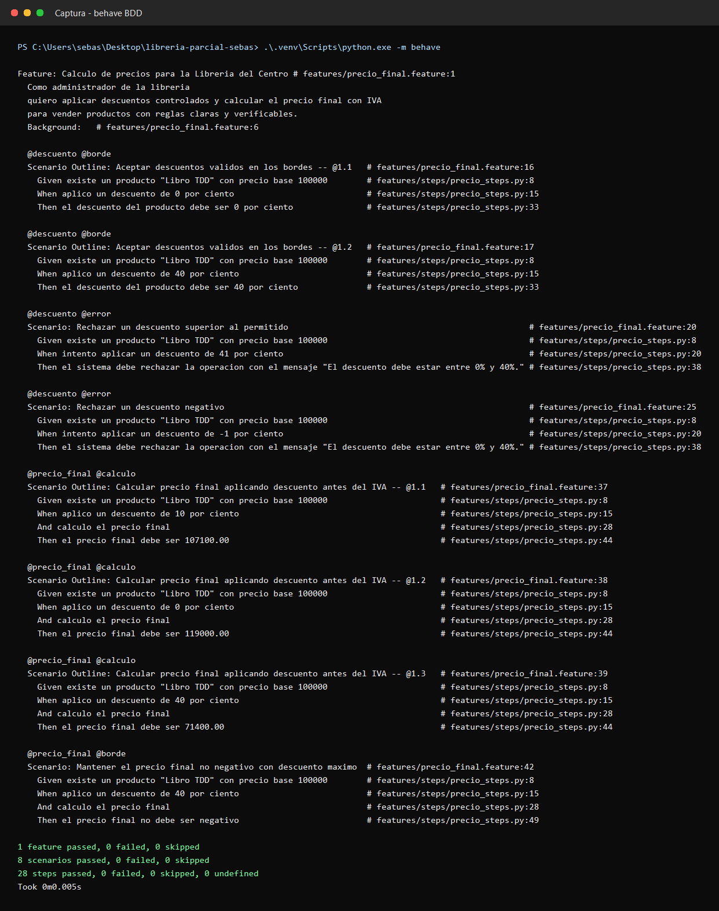

# Evidencias de ejecucion de pruebas

Fecha de verificacion local: 2026-05-22

## Pruebas unitarias y cobertura

Comando ejecutado:

```bash
.venv\Scripts\python -m pytest
```

Captura:



## Escenarios BDD

Comando ejecutado:

```bash
.venv\Scripts\python -m behave
```

Captura:


